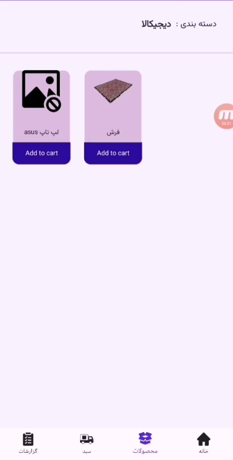
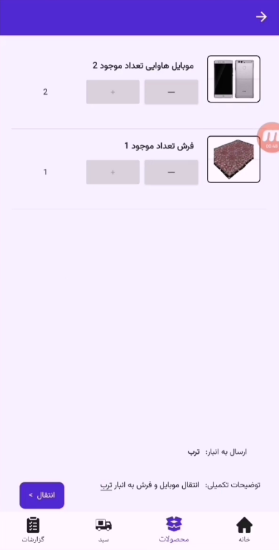

# ShopManagerMaui
Shop Manager with maui and asp.net core webApi


## How to use

Clone the project

```bash
  git clone https://github.com/ebrahimkhodadadi/ShopManagerMaui.git
```

Change Sql server connection string

```bash
  Src\ShopManagerMaui\appsettings.Development
```

Change Maui Api url

```bash
  Src\MauiShopApp\Resources\Raw\appsettings.json
```


## Roadmap

- no need to migaration it used Auto Migration

## Screenshot's
   
